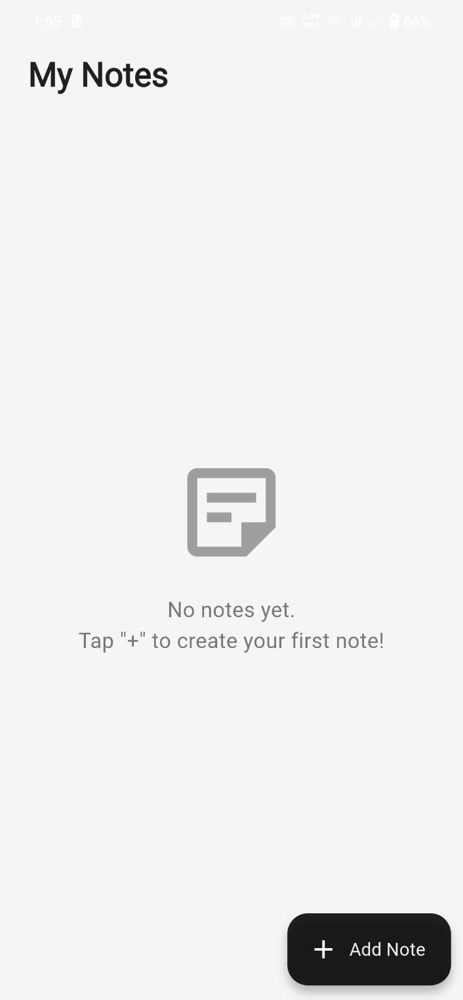
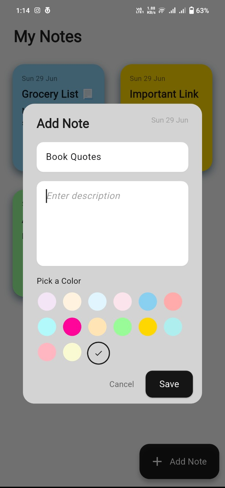
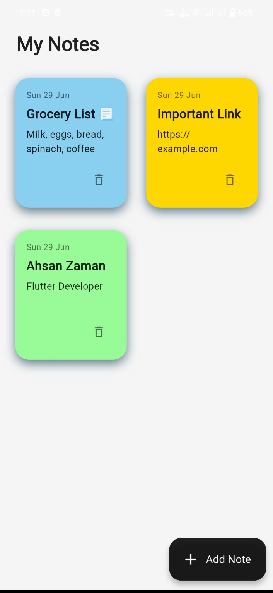

<div align="center">

# 🗒️ Flutter Notes App

### A clean, responsive, and beautifully animated notes app built with Flutter & SQLite


A clean, responsive, and beautifully animated **Notes App** built using **Flutter** and **Sqflite**, designed for a smooth and intuitive note-taking experience. Easily create, edit, delete, and categorize your notes — all stored locally on your device.


</div>

---

## 📱 Features

<table>
<tr>
<td width="50%">

### ✏️ **Note Management**
- ✍️ Create, edit & delete notes effortlessly
- 🎨 Color-coded organization system
- 📅 Automatic timestamps for tracking
- 🔍 Quick note searching capabilities

</td>
<td width="50%">

### 🎨 **User Experience**
- ⚡ Animated floating action button
- 📱 Responsive design for all devices
- 🧼 Professional Material 3 UI/UX
- 📂 100% offline functionality

</td>
</tr>
</table>

### 🔧 **Technical Features**
- 💾 **Local SQLite Storage** - Secure offline data persistence
- 🎭 **Smooth Animations** - Engaging user interactions
- 🧩 **Modular Architecture** - Clean, maintainable codebase
- ⚡ **Fast Performance** - Optimized database operations

---

## 🖼️ Screenshots

<table>
  <tr>
    <td align="center">
      
      <br/><strong>📋 Home Screen</strong>
      <br/><em>Clean note overview</em>
    </td>
    <td align="center">
      
      <br/><strong>➕ Add Note</strong>
      <br/><em>Intuitive creation</em>
    </td>
    <td align="center">
      
      <br/><strong>🌈 Color Organization</strong>
      <br/><em>Visual categorization</em>
    </td>
  </tr>
</table>

---

## 🎥 Demo Video

<div align="center">

[](https://github.com/ahsxndev/notes_app/raw/main/assets/demo.mp4)

*See the app in action with smooth animations and features*

</div>

---

## 🛠️ Tech Stack & Architecture

<div align="center">

| Technology | Purpose | Features |
|------------|---------|----------|
| **Flutter** | Cross-platform framework | iOS, Android, Web support |
| **Dart** | Programming language | Null safety, async/await |
| **Sqflite** | Local database | CRUD operations, SQL queries |
| **Material 3** | UI components | Modern design system |

</div>

### 🏗️ **Architecture Benefits**
- 🔄 **Reactive UI** - Real-time updates with state management
- 🗃️ **Database Layer** - Efficient SQLite operations
- 🎨 **Widget Separation** - Reusable, maintainable components
- 📱 **Responsive Design** - Adapts to different screen sizes

---

## 📁 Project Structure

```
lib/
├── 📂 database/
│   └── 🗃️ notes_database.dart        # SQLite CRUD operations
├── 📂 models/
│   └── 📄 note_model.dart            # Note data structure
├── 📂 screens/
│   └── 📱 notes_screen.dart          # Main application screen
├── 📂 widgets/
│   ├── 🎴 note_card.dart             # Individual note display
│   └── 💬 note_dialog.dart           # Add/Edit note interface
└── 🚀 main.dart                      # App entry point
```

---

## 🚀 Getting Started

### Prerequisites
```bash
Flutter SDK    >=3.0.0
Dart SDK       >=2.17.0
Android Studio or VS Code
```

### Installation

1. **Clone the Repository**
   ```bash
   git clone https://github.com/ahsxndev/notes_app.git
   cd notes_app
   ```

2. **Install Dependencies**
   ```bash
   flutter pub get
   ```

3. **Run the Application**
   ```bash
   # Run on connected device/emulator
   flutter run
   
   # Or specify platform
   flutter run -d android
   flutter run -d ios
   ```

### 🔧 **Build for Production**
```bash
# Android APK
flutter build apk --release

# Android App Bundle
flutter build appbundle --release

# iOS
flutter build ios --release
```

---

## 📦 Dependencies

| Package | Version | Purpose |
|---------|---------|---------|
| `sqflite` | Latest | SQLite database operations |
| `path` | Latest | File path utilities |
| `intl` | Latest | Date formatting |

---


## 🤝 Contributing

<div align="center">

**Help make this notes app even better!**

</div>

### How to Contribute
1. **Fork** the repository
2. **Create** a feature branch (`git checkout -b feature/amazing-feature`)
3. **Commit** your changes (`git commit -m 'Add amazing feature'`)
4. **Push** to the branch (`git push origin feature/amazing-feature`)
5. **Open** a Pull Request

### 🎯 **Areas for Contribution**
- 🎨 **UI/UX Improvements** - Enhance design and animations
- 🔧 **New Features** - Add functionality from roadmap
- 🐛 **Bug Fixes** - Report and fix issues
- 📖 **Documentation** - Improve code comments and docs
- 🧪 **Testing** - Add unit and widget tests

---

## 📄 License

This project is licensed under the **MIT License** - see the [LICENSE](LICENSE) file for details.

---

## 🙏 Acknowledgments

**Special Thanks:**

📱 **Flutter Team** - For the incredible cross-platform framework  
🗃️ **Sqflite Contributors** - For reliable local database solutions  
🎨 **Material Design** - For beautiful UI guidelines  
🌟 **Open Source Community** - For inspiration and feedback  

---

## 👤 Author & Contact

<div align="center">

### **Ahsan Zaman**
*Flutter Developer & Mobile App Enthusiast*

[](https://github.com/ahsxndev)
[](https://linkedin.com/in/ahxanzaman)
[](mailto:ahsanzaman.dev@gmail.com)

**Found this helpful?** Give it a ⭐ on GitHub!

[](https://github.com/ahsxndev)
[](https://github.com/ahsxndev/notes_app)

</div>

---

<div align="center">

**Built with ❤️ using Flutter**

*Simple. Clean. Efficient.* 📝✨

**"The best ideas come when you have a place to capture them"**

[⭐ Star this repo](https://github.com/ahsxndev/notes_app) • [🐛 Report Bug](https://github.com/ahsxndev/notes_app/issues) • [💡 Request Feature](https://github.com/ahsxndev/notes_app/issues)

</div>
